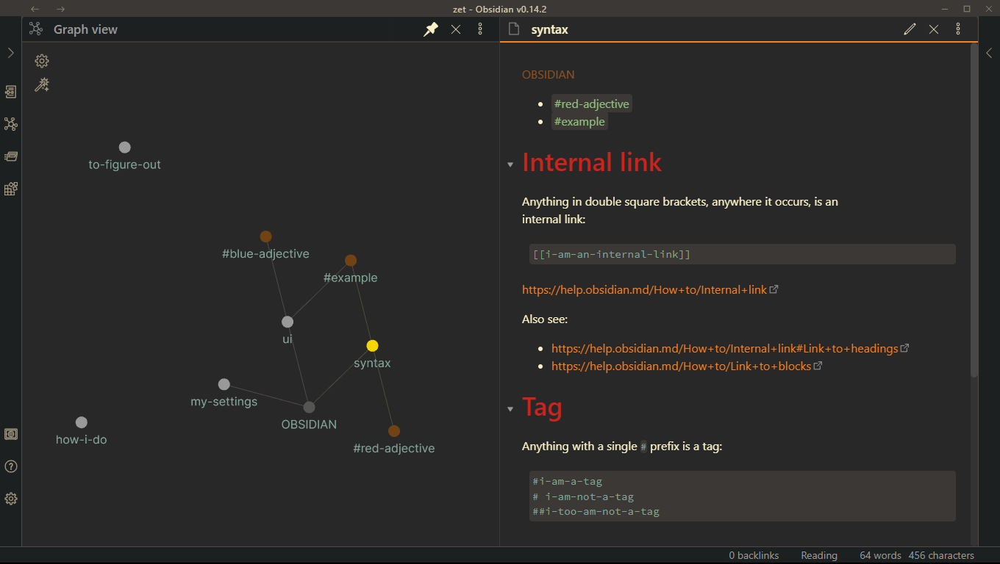

# What this is

- How I use Obsidian
- Things I've figured out
- Things I want to figure out
- A playground to try new Obsidian ideas

# How to use it

- Clone this repository
- the `.obsidian` folder is at the top-level (same level as
  `.git`):

    ```
    .
    ├── .git
     ...
    ├── .obsidian
    │   ├── app.json
    │   ├── appearance.json
    │   ├── core-plugins.json
    │   ├── graph.json
    │   ├── hotkeys.json
    │   ├── themes
    │   │   └── Obsidian gruvbox.css
    │   └── workspace
    ├── doc
    │   ├── img
    │   │   └── screenshot-what_this_vault_looks_like.PNG
    │   └── zet
    │       ├── bare.py
    │       ├── how-i-do.md
    │       ├── img
    │       │   └── vault_for_proj_at_work--kindle_notebk_in_vault_as_markdown.PNG
    │       ├── my-settings.md
    │       ├── syntax.md
    │       ├── to-figure-out.md
    │       └── ui.md
    └── README.md
    ```

- Open the vault in obsidian

It opens as the graph. Click on a file node (a white dot) and it
looks like this:



# Clean Obsidian vault

The vault was getting to be a mess. I came up with a new method for
using it.

## New Shortcuts

These shortcuts take advantage of the new organization:

```vim
;oq<Space> -- query word under cursor (identifies tags)
;oqh -- query hierarchy files
;oqs -- query session files
```

## New Organization
- use tags for finding groups of related files.
    - tags are my default method for categorizing files without thinking
      about a hierarchy
- toggle view of tags with `C-M-Left`
    - `;oq<Space>` to search for tag (or any word) under cursor
- use nested tags `#high/mid/low` to organize tags into a hierarchy
- use `_1_` `_2_` `_3_` files to impose a hierarchy on files
    - `;oqh` to search for HIERARCHY files
    - *this is a different idea from tags*
    - my notes do not link to hierarchy files
    - my hierarchy files link to my notes
    - this does two things:
        - imposes a structure on the graph view
        - create a local graph view for files of interest
- use `_0_` files to save session
    - `;oqs` to search for SESSION files
    - so far, I just have `_0_LEFT-OFF.md` and `_0_START-HERE.md`
    - I update `LEFT-OFF` with links to the files I currently care
      about
    - I use `START-HERE` to document a place to start looking on a
      region of the graph
      
# Other shortcuts

## Basic      

- `;oh` open the Obsidian vault for the pwd
- `;ok` convert Kindle Notebook to Markdown

## Adding links
Say I have created a link. Now I want to use that same link at every other occurrence of this word in my file.

- `;ol<Space>` use this Obsidian Pipe Link to replace all occurrences of the pipe text in this document (must match case)
- `;olc` like `;ol<Space>` but ignore case and ask for confirmation before each replacement